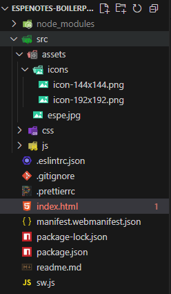

# **Plantilla Base para Progresive Web Apps (PWA) – ESPE**

Este repositorio proporciona una **estructura base optimizada** para el desarrollo de aplicaciones web progresivas (PWA), ideal para proyectos personales, académicos o profesionales. Incluye servidor de desarrollo con recarga automática, herramientas de calidad de código y configuración básica de service worker y manifest.

## **Características**

- Estructura modular de archivos (`src/`, `css/`, `js/`, `assets/`).
- Configuración lista para desarrollo con `live-server`
- Linting con `ESLint` y formateo automático con `Prettier`.
- Scripts de automatización vía `npm`
- Manifest y Service Worker funcionales
- Diseño base con Material Design Lite (MDL)


## **Instalación**

Para instalar y configurar el proyecto en tu máquina local, sigue estos pasos:

### **1. Clona el repositorio**

Si aún no has clonado el repositorio, utiliza el siguiente comando para clonarlo:

```bash
git https://github.com/arquimides12/espenotes_modules.git 
```
En mi caso sucedio esto ya que cree el repositorio despues.

# Instala las dependencias
Entra en el directorio del proyecto y ejecuta el siguiente comando para instalar las dependencias:

```bash
npm install
npm run dev
```

Esto abrirá la aplicación en: 
```bash
 http://127.0.0.1:8080/.
``` 
Esto abrirá la app en tu navegador mediante `live-server`, con recarga en tiempo real.

- Para formatear el código automáticamente:

```bash
npm run format
``` 
- Para verificar errores de estilo y sintaxis: 

```bash
npm run lint
``` 
-Para simular entorno de producción:

```bash
npm run serve
``` 

## Estructrua del Proyecto 




## Reutilización en Nuevos Proyectos

Para usar esta plantilla en futuros proyectos:

- Copia la estructura completa del repositorio.

- Cambia el contenido de index.html, manifest.json y app.js según el nuevo proyecto.

- Mantén package.json y los scripts para seguir utilizando el entorno automatizado.

- Personaliza src/assets/icons/ con íconos propios.

- Actualiza README.md según corresponda.

## Recomendaciones 
-  Usa extensiones como ESLint y Prettier en tu editor (VSCode) para mantener calidad de código en tiempo real.
- Asegúrate de servir tu aplicación desde un entorno HTTPS para probar funcionalidades PWA como serviceWorker o instalación.
- Puedes mejorar la estructura CSS usando un framework más robusto como Tailwind o Bootstrap si el proyecto lo requiere.

## Licencia 

MIT - Puedes usar libremente este código para fines personales, académicos o comerciales.


```html
<!DOCTYPE html>
<html lang="en">
<head>
    <meta charset="UTF-8">
    <meta name="viewport" content="width=device-width, initial-scale=1.0">
    <title>Laboratorio 1</title>
    <link rel="stylesheet" href="css/styles.css"> <!-- Estilos -->
    <script type="module" src="./src/index.js"></script> <!-- Conexión al archivo JS -->
<body>
    
</body>
</html>
```
se utiliza como punto de entrada donde se cargan todos los componentes y estilos. index.js se incluye como un script de módulo, lo que permite el uso de ES6+ y la importación de componentes.


## index.js 
En este archivo se configuran los componentes de LitElement y se controlan las interacciones y la lógica de la aplicación.

```js 
import "./components/espe-header.js";
import "./components/espe-task-list.js";
import "./components/espe-task-items.js";
import "./components/espe-task-form.js";
import "./components/espe-task-detail.js";
import '../css/styles.css';
// Aquí se puede agregar lógica como eventos, actualización de datos, etc.
```

index.js importa los componentes definidos en la carpeta src/components. Cada componente es una clase que extiende de LitElement y define su estructura y comportamiento.

index.js importa los componentes definidos en la carpeta src/components. Cada componente es una clase que extiende de LitElement y define su estructura y comportamiento.

Aquí definimos variables CSS para mantener una apariencia consistente y se utilizan en los componentes como LitElement. Las variables como --bg-primary, --text-primary se utilizan en los componentes para personalizar colores y otros estilos. 


## package.json

El archivo package.json contiene los metadatos del proyecto, como el nombre, la versión, las dependencias y los scripts para ejecutar tareas.


dependencies: Aquí están las dependencias del proyecto, como lit, que es la librería para crear los componentes web.

devDependencies: Contiene las dependencias necesarias para el desarrollo, como Webpack, webpack-cli y webpack-dev-server.

Los scripts definidos en package.json permiten ejecutar comandos como npm run serve para iniciar el servidor de desarrollo con Webpack.

## Uso en Componentes
 
Dentro de los componentes LitElement, las variables definidas en styles.css se pueden usar para personalizar los colores y otros estilos.

```js 
static get styles() {
  return css`
    :host {
      display: block;
      background-color: var(--bg-primary);  /* Utilizando las variables CSS definidas */
      color: var(--text-primary);
    }
  `;
}
```
### Importación del CSS: 

En el archivo index.html, el archivo CSS se importa para que se apliquen los estilos globales a todos los componentes:

# Componentes en ESPE Tasks

### espe-task-item.js

- Muestra una tarea individual dentro de la lista.
- Permite editar o eliminar la tarea.
- Presenta los detalles básicos de la tarea, como nombre, hora y prioridad.

Para que sirve? 
Para interactuar con cada tarea de forma individual presenta  la información básica de cada tarea y permite realizar acciones sobre ella.

```js 
import { LitElement, html, css } from 'lit-element';
class EspeTaskItem extends LitElement {
    static get styles() {
        return css`
            /* Estilos para una tarea individual */
            :host {
                display: block;
                padding: 10px;
                background-color: #f4f4f4;
                border-radius: 5px;
            }
        `;
    }
    render() {
        return html`
            <div class="task-item">
                <p>Nombre de la tarea</p>
                <button @click="${this._editTask}">Editar</button>
                <button @click="${this._deleteTask}">Eliminar</button>
            </div>
        `;
    }
    _editTask() {
        // Lógica para editar la tarea
    }
    _deleteTask() {
        // Lógica para eliminar la tarea
    }
}

customElements.define('espe-task-item', EspeTaskItem);
```
### espe-task-form.js

- Proporciona un formulario para agregar o editar tareas.
- Incluye campos como nombre de la tarea, fecha, hora y prioridad.
- Realiza validaciones para asegurarse de que los campos estén completos.

```js 
import { LitElement, html, css } from 'lit-element';
class EspeTaskForm extends LitElement {
    static get styles() {
        return css`
            /* Estilos para el formulario */
            :host {
                display: block;
                padding: 20px;
                background-color: #ffffff;
            }
        `;
    }
    render() {
        return html`
            <form>
                <label for="taskName">Nombre</label>
                <input id="taskName" type="text" required>
                <button type="submit">Agregar tarea</button>
            </form>
        `;
    }
}
customElements.define('espe-task-form', EspeTaskForm);
```
### espe-task-detail.js

- Muestra los detalles completos de una tarea seleccionada.
- Permite editar o marcar como completada la tarea.
```js 
import { LitElement, html, css } from 'lit-element';

class EspeTaskDetail extends LitElement {
    static get styles() {
        return css`
            /* Estilos para la vista de detalles */
            :host {
                display: block;
                padding: 20px;
                background-color: #f0f0f0;
            }
        `;
    }
    render() {
        return html`
            <div class="task-detail">
                <h2>Tarea Detallada</h2>
                <p>Nombre de la tarea: Tarea de ejemplo</p>
                <button @click="${this._markCompleted}">Marcar como completada</button>
            </div>
        `;
    }
    _markCompleted() {
        // Lógica para marcar la tarea como completada
    }
}
customElements.define('espe-task-detail', EspeTaskDetail);
```
# Ejecución

Al finalizar tendremos un CRUD que cumple las funciones

# Agregar

Este es el formulario que se me da para llenar los datos 


Al finalizar el agragado ponemos guardar 


# Editar


- Al finalizar la edición nos dara este resultado 


# Eliminar 


 

# Guardar 


 
# Final Ejecución

```bash
 http://localhost:8080.
```

